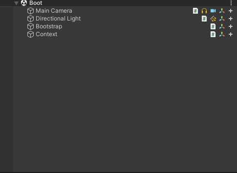

<h1 align="center">Find the Way</h1>

___


## Find the Way - это мой пет проект где я решил проверить некоторые архитектурные решения

**Архитектура проекта функционирует следующим образом**
- Есть глобальная машина состояний `GameStateMachine` которая определяет как системы должны реагировать.
```c#
  public class GameStateMachine{
        
        private IGameState _currentState;
        private Dictionary<Type, IGameState> _gameStates;
        
        public GameStateMachine() {
            _gameStates = new Dictionary<Type, IGameState>() {
                [typeof(BootstrapState)] = new BootstrapState(this),
                [typeof(LoadingState)] = new LoadingState(this),
                [typeof(GamePlayState)] = new GamePlayState(),
            };
        }
        public void SwitchState<TState>() where TState: IGameState {
            if(_currentState != null) 
                _currentState.Exit();
            _currentState = _gameStates[typeof(TState)];
            _currentState?.Enter();
        }
    }
```
- Есть место где игра запускается `Bootstraper` 

```c#
public class Bootstrapper : MonoBehaviour {
        private void Start() {
            
            Container.Instance.GameStateMachine.SwitchState<BootstrapState>();
        }
    }
```
 - Ну и своеобразный `Conteiner` для зависимостей, но на данный момент это синглтон с сервисами который нужны весь Runtime

```c#
  public class Container  : MonoBehaviour {
        public static Container Instance { get; private set;}
        
        private GameStateMachine.GameStateMachine _gameStateMachine;
        private InputService _inputService;
        private Factory _factory;
        public GameStateMachine.GameStateMachine GameStateMachine => _gameStateMachine;
        public InputService InputService => _inputService;
        public Factory Factory => _factory;

        private void Awake() { 
            
            Init();
            _gameStateMachine = new GameStateMachine.GameStateMachine();
            _inputService = new InputService();
            _factory = new Factory();
        }

        private void Init() {
            if(Instance != null)
                Destroy(gameObject);
            Instance = this;
            DontDestroyOnLoad(this);
        }
    }
```

`Это архитектурное решение довольно сильно упрощает разработку 
тем что понятно где начитается и заканчивается игра. Плюс в целом глобальная машина
состояний также очень удобна по сути это что-то вроде умного менеджера
который говорит всем системам которые скажем так его уважают или же слушают 
поступить так как они хотят исходя из состояния которые им дал менеджен.`

### Так же хочу поделиться кадрами из проектика

- **Это так сказать Boot сцена.** Иконки справа от объектов это плагин который я недавно нашел довольно удобный. `Sortify` 




- **Ну и собственно игровая сцена**


**Интегрировал `Shader` который отвечает за смену времени суток**


**Ну и поигрался с запеканием света**


**Пока что успел добавить `Outline Shader` чтобы обозначить что с объектом можно взаимодействовать**


